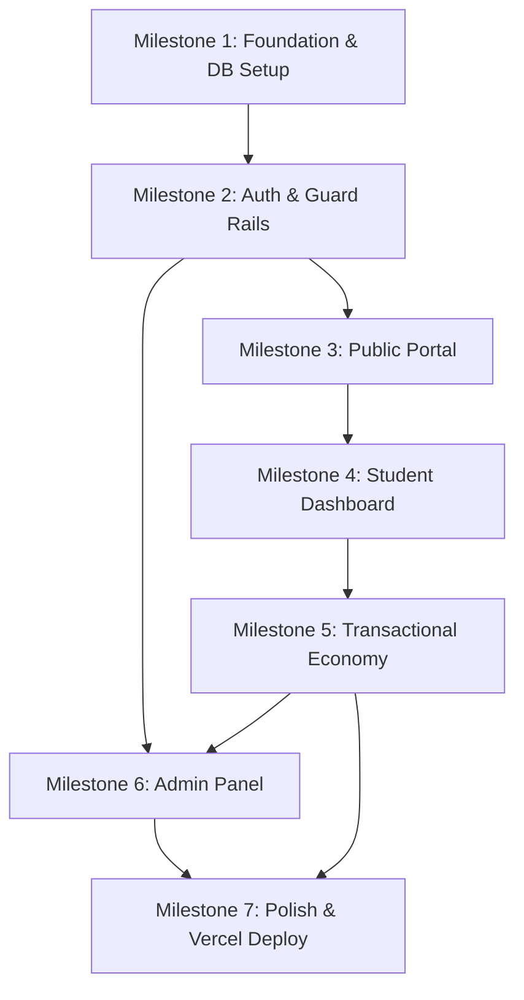

# Implementation Plan - Bank Catatan Mahasiswa

This document outlines the step-by-step implementation plan for building the **Bank Catatan Mahasiswa** MVP platform. It is structured to be implementation-ready for Cursor AI, mapping requirements from `TASKS.md`, `PRODUCT.md`, `DATABASE.md`, and `ARCHITECTURE.md`.

---

## User Review Required

> [!IMPORTANT]
> **Database Transaction Safety**: Since Supabase Javascript Client does not support complex multi-statement SQL transactions directly in single client calls, we will implement three critical transactions via PostgreSQL RPC functions:
> 1. `handle_note_download` (Coin verification, coin deduction, note_downloads record creation, coin_transactions auditing, note download_count incrementing).
> 2. `handle_note_approval` (Note status update, +5 coins rewarding to uploader, coin_transactions auditing).
> 3. `handle_topup_approval` (Topup status update, coin_amount addition to user balance, coin_transactions auditing).
>
> **Access to PDF Files**: The bucket `notes-files` will be private. The PDF files will be downloaded/streamed securely via an API Route Handler `/api/notes/download` which invokes the `handle_note_download` RPC to validate permissions before serving.

---

## Master Milestones Overview

| Milestone | Target Phases | Description | Complexity | Est. Duration |
| :--- | :--- | :--- | :--- | :--- |
| **M1: Foundation & Database** | Phases 1 & 2 | Base Next.js project config and complete Supabase DB schema with RLS and RPCs | Medium | 1.5 Days |
| **M2: Auth & Guard Rails** | Phase 3 | Supabase Auth Integration, Profile Triggers, and Role-Based Middleware | Medium | 1.0 Day |
| **M3: Public Portal** | Phase 4 | Public Landing, Catalog Search/Filters, FAQ, and Note Details (Preview) | Medium | 1.5 Days |
| **M4: Student Dashboard** | Phases 5 & 6 | Student Dashboard layout, Upload form with file constraint validation | Medium | 1.5 Days |
| **M5: Transactional Economy** | Phases 8, 9, 10 | Coin balance tracking, transaction history, Top up requests, and secure downloads | High | 2.5 Days |
| **M6: Admin Moderation** | Phases 7, 11-13 | Admin Dashboard, Verification queues, Master data CRUDs, Comment hiding | High | 2.0 Days |
| **M7: Polish & Production** | Phases 14-16 | Loading skeletons, RLS audits, edge cases, Vercel build, and deployment | Low-Med | 1.0 Day |

---

## Milestones & Detailed Phases

### Milestone 1: Foundation & Database Setup (Phases 1-2)

#### Deliverables
1. Initialized Next.js project with App Router, TypeScript, Tailwind CSS, and shadcn/ui.
2. Configuration of ESLint, Prettier, and environment variables.
3. Supabase Schema migration containing all 9 tables, constraints, indexes, triggers, and RPCs.
4. Supabase Storage Buckets configured: `notes-files` (private), `topup-proofs` (private), `avatars` (public).

#### Dependencies
- None (First step)

#### Acceptance Criteria
- Dev server runs locally without build or lint errors.
- Database tables, foreign key constraints, indexes, and RPC functions compile correctly in Supabase.
- Storage buckets are successfully provisioned with correct public/private status.

#### Proposed Database DDL Schema (For Supabase SQL Editor)
```sql
-- Enable UUID extension
create extension if not exists "uuid-ossp";

-- 1. Semesters Table
create table public.semesters (
  id bigserial primary key,
  name varchar(50) not null,
  created_at timestamp with time zone default now(),
  updated_at timestamp with time zone default now()
);

-- 2. Categories Table
create table public.categories (
  id bigserial primary key,
  name varchar(100) not null,
  slug varchar(120) not null unique,
  description text,
  created_at timestamp with time zone default now(),
  updated_at timestamp with time zone default now()
);

-- 3. Courses Table
create table public.courses (
  id bigserial primary key,
  category_id bigint references public.categories(id) on delete set null,
  semester_id bigint references public.semesters(id) on delete set null,
  name varchar(120) not null,
  slug varchar(140) not null unique,
  code varchar(30),
  description text,
  created_at timestamp with time zone default now(),
  updated_at timestamp with time zone default now()
);

-- 4. Profiles Table (Linked to auth.users)
create table public.profiles (
  id uuid primary key references auth.users(id) on delete cascade,
  name varchar(100) not null,
  role varchar(20) not null default 'user',
  coin_balance integer not null default 0,
  nim varchar(30),
  major varchar(100),
  semester_id bigint references public.semesters(id) on delete set null,
  avatar_url text,
  is_active boolean not null default true,
  created_at timestamp with time zone default now(),
  updated_at timestamp with time zone default now(),
  constraint check_role check (role in ('user', 'admin'))
);

-- 5. Notes Table
create table public.notes (
  id bigserial primary key,
  user_id uuid not null references public.profiles(id) on delete cascade,
  category_id bigint references public.categories(id) on delete set null,
  course_id bigint references public.courses(id) on delete set null,
  semester_id bigint references public.semesters(id) on delete set null,
  title varchar(180) not null,
  slug varchar(220) not null unique,
  description text,
  file_path text not null,
  file_original_name varchar(255),
  file_type varchar(50),
  file_size bigint,
  coin_price integer not null default 3,
  status varchar(20) not null default 'pending',
  rejection_reason text,
  download_count integer not null default 0,
  view_count integer not null default 0,
  approved_by uuid references public.profiles(id) on delete set null,
  approved_at timestamp with time zone,
  created_at timestamp with time zone default now(),
  updated_at timestamp with time zone default now(),
  constraint check_status check (status in ('pending', 'approved', 'rejected')),
  constraint check_rejection_reason check (status != 'rejected' or (status = 'rejected' and rejection_reason is not null))
);

-- 6. Note Downloads Table
create table public.note_downloads (
  id bigserial primary key,
  user_id uuid not null references public.profiles(id) on delete cascade,
  note_id bigint not null references public.notes(id) on delete cascade,
  coin_spent integer not null,
  downloaded_at timestamp with time zone default now(),
  created_at timestamp with time zone default now(),
  updated_at timestamp with time zone default now(),
  constraint unique_user_note_download unique(user_id, note_id)
);

-- 7. Coin Transactions Table
create table public.coin_transactions (
  id bigserial primary key,
  user_id uuid not null references public.profiles(id) on delete cascade,
  type varchar(30) not null,
  amount integer not null,
  balance_before integer not null,
  balance_after integer not null,
  description text,
  reference_type varchar(50),
  reference_id bigint,
  created_at timestamp with time zone default now(),
  updated_at timestamp with time zone default now(),
  constraint check_transaction_type check (type in ('topup', 'download', 'upload_reward', 'admin_adjustment'))
);

-- 8. Topups Table
create table public.topups (
  id bigserial primary key,
  user_id uuid not null references public.profiles(id) on delete cascade,
  amount integer not null,
  coin_amount integer not null,
  payment_method varchar(30) not null,
  proof_image text,
  status varchar(20) not null default 'pending',
  admin_note text,
  verified_by uuid references public.profiles(id) on delete set null,
  verified_at timestamp with time zone,
  created_at timestamp with time zone default now(),
  updated_at timestamp with time zone default now(),
  constraint check_topup_status check (status in ('pending', 'success', 'rejected')),
  constraint check_payment_method check (payment_method in ('transfer_bank', 'qris', 'ewallet'))
);

-- 9. Comments Table
create table public.comments (
  id bigserial primary key,
  user_id uuid not null references public.profiles(id) on delete cascade,
  note_id bigint not null references public.notes(id) on delete cascade,
  content text not null,
  status varchar(20) not null default 'visible',
  created_at timestamp with time zone default now(),
  updated_at timestamp with time zone default now(),
  constraint check_comment_status check (status in ('visible', 'hidden'))
);

-- Indexes
create index idx_notes_status on public.notes(status);
create index idx_notes_user_id on public.notes(user_id);
create index idx_notes_category_id on public.notes(category_id);
create index idx_notes_course_id on public.notes(course_id);
create index idx_notes_semester_id on public.notes(semester_id);
create index idx_notes_title on public.notes(title);
create index idx_comments_note_id on public.comments(note_id);
create index idx_topups_status on public.topups(status);
create index idx_coin_transactions_user_id on public.coin_transactions(user_id);
create index idx_note_downloads_user_id on public.note_downloads(user_id);
create index idx_note_downloads_note_id on public.note_downloads(note_id);
```

#### Row Level Security (RLS) Configuration
```sql
-- Enable RLS on all tables
alter table public.profiles enable row level security;
alter table public.semesters enable row level security;
alter table public.categories enable row level security;
alter table public.courses enable row level security;
alter table public.notes enable row level security;
alter table public.note_downloads enable row level security;
alter table public.coin_transactions enable row level security;
alter table public.topups enable row level security;
alter table public.comments enable row level security;

-- 1. Profiles Policies
create policy "Public profiles are viewable by everyone" on public.profiles for select using (true);
create policy "Users can update their own profile fields" on public.profiles for update 
  using (auth.uid() = id)
  with check (
    auth.uid() = id 
    and (role = (select role from public.profiles where id = auth.uid())) -- Cannot alter own role
    and (coin_balance = (select coin_balance from public.profiles where id = auth.uid())) -- Cannot alter own balance
  );
create policy "Admins have full access on profiles" on public.profiles for all using (
  exists (select 1 from public.profiles where id = auth.uid() and role = 'admin')
);

-- 2. Semesters, Categories, Courses Policies (Public Read, Admin Write)
create policy "Anyone can read semesters" on public.semesters for select using (true);
create policy "Admins can modify semesters" on public.semesters for all using (
  exists (select 1 from public.profiles where id = auth.uid() and role = 'admin')
);

create policy "Anyone can read categories" on public.categories for select using (true);
create policy "Admins can modify categories" on public.categories for all using (
  exists (select 1 from public.profiles where id = auth.uid() and role = 'admin')
);

create policy "Anyone can read courses" on public.courses for select using (true);
create policy "Admins can modify courses" on public.courses for all using (
  exists (select 1 from public.profiles where id = auth.uid() and role = 'admin')
);

-- 3. Notes Policies
create policy "Anyone can view approved notes" on public.notes for select using (status = 'approved');
create policy "Users can view their own notes" on public.notes for select using (auth.uid() = user_id);
create policy "Admins can view all notes" on public.notes for select using (
  exists (select 1 from public.profiles where id = auth.uid() and role = 'admin')
);
create policy "Users can insert notes" on public.notes for insert with check (auth.uid() = user_id);
create policy "Users can update their own pending notes" on public.notes for update using (
  auth.uid() = user_id and status = 'pending'
);
create policy "Admins can update status and metadata of all notes" on public.notes for update using (
  exists (select 1 from public.profiles where id = auth.uid() and role = 'admin')
);

-- 4. Note Downloads Policies
create policy "Users can view their own downloads" on public.note_downloads for select using (auth.uid() = user_id);
create policy "Admins can view all downloads" on public.note_downloads for select using (
  exists (select 1 from public.profiles where id = auth.uid() and role = 'admin')
);
-- Inserts happen via Security Definer RPC

-- 5. Coin Transactions Policies
create policy "Users can view their own coin transactions" on public.coin_transactions for select using (auth.uid() = user_id);
create policy "Admins can view all coin transactions" on public.coin_transactions for select using (
  exists (select 1 from public.profiles where id = auth.uid() and role = 'admin')
);
-- Inserts happen via Security Definer RPC

-- 6. Topups Policies
create policy "Users can view their own topups" on public.topups for select using (auth.uid() = user_id);
create policy "Users can submit topups" on public.topups for insert with check (auth.uid() = user_id);
create policy "Admins can view and update all topups" on public.topups for all using (
  exists (select 1 from public.profiles where id = auth.uid() and role = 'admin')
);

-- 7. Comments Policies
create policy "Anyone can view visible comments" on public.comments for select using (status = 'visible');
create policy "Users can insert comments" on public.comments for insert with check (auth.uid() = user_id);
create policy "Admins can moderate comments" on public.comments for all using (
  exists (select 1 from public.profiles where id = auth.uid() and role = 'admin')
);
```

#### RPC Transactions Configuration (Crucial for Economy Logic)
```sql
-- Trigger to automatically create a profile record upon sign up
create or replace function public.handle_new_user()
returns trigger as $$
begin
  insert into public.profiles (id, name, role, coin_balance, nim, major, semester_id, avatar_url, is_active)
  values (
    new.id,
    coalesce(new.raw_user_meta_data->>'name', 'Mahasiswa Baru'),
    'user',
    0,
    null,
    null,
    null,
    null,
    true
  );
  return new;
end;
$$ language plpgsql security definer;

create or replace trigger on_auth_user_created
  after insert on auth.users
  for each row execute procedure public.handle_new_user();

-- Transaction RPC: Handle Note Download
create or replace function public.handle_note_download(
  p_user_id uuid,
  p_note_id bigint
) returns json as $$
declare
  v_coin_price integer;
  v_current_balance integer;
  v_already_downloaded boolean;
  v_note_file_path text;
  v_new_download_id bigint;
begin
  -- 1. Check if already purchased
  select exists(
    select 1 from public.note_downloads
    where user_id = p_user_id and note_id = p_note_id
  ) into v_already_downloaded;

  select file_path, coin_price into v_note_file_path, v_coin_price
  from public.notes
  where id = p_note_id and status = 'approved';

  if v_note_file_path is null then
    return json_build_object('success', false, 'message', 'Catatan tidak ditemukan atau belum disetujui');
  end if;

  if v_already_downloaded then
    return json_build_object('success', true, 'message', 'Sudah pernah diunduh', 'file_path', v_note_file_path);
  end if;

  -- 2. Fetch User Coin Balance
  select coin_balance into v_current_balance
  from public.profiles
  where id = p_user_id;

  if v_current_balance < v_coin_price then
    return json_build_object('success', false, 'message', 'Saldo koin tidak cukup');
  end if;

  -- 3. Execute Transaction
  -- Deduct Coin from Profile
  update public.profiles
  set coin_balance = coin_balance - v_coin_price
  where id = p_user_id;

  -- Log Download record
  insert into public.note_downloads (user_id, note_id, coin_spent)
  values (p_user_id, p_note_id, v_coin_price)
  returning id into v_new_download_id;

  -- Audit Coin Transaction
  insert into public.coin_transactions (user_id, type, amount, balance_before, balance_after, description, reference_type, reference_id)
  values (
    p_user_id,
    'download',
    -v_coin_price,
    v_current_balance,
    v_current_balance - v_coin_price,
    'Mengunduh catatan ID: ' || p_note_id,
    'note_downloads',
    v_new_download_id
  );

  -- Increment note's download counter
  update public.notes
  set download_count = download_count + 1
  where id = p_note_id;

  return json_build_object('success', true, 'message', 'Download berhasil', 'file_path', v_note_file_path);
end;
$$ language plpgsql security definer;

-- Transaction RPC: Handle Note Approval + Reward
create or replace function public.handle_note_approval(
  p_note_id bigint,
  p_admin_id uuid
) returns json as $$
declare
  v_uploader_id uuid;
  v_current_balance integer;
  v_status varchar;
begin
  select user_id, status into v_uploader_id, v_status
  from public.notes
  where id = p_note_id;

  if v_status != 'pending' then
    return json_build_object('success', false, 'message', 'Catatan tidak dalam status pending');
  end if;

  -- 1. Approve Note
  update public.notes
  set status = 'approved',
      approved_by = p_admin_id,
      approved_at = now()
  where id = p_note_id;

  -- 2. Fetch Uploader Coin Balance
  select coin_balance into v_current_balance
  from public.profiles
  where id = v_uploader_id;

  -- 3. Reward +5 Coins
  update public.profiles
  set coin_balance = coin_balance + 5
  where id = v_uploader_id;

  -- 4. Audit Coin Transaction
  insert into public.coin_transactions (user_id, type, amount, balance_before, balance_after, description, reference_type, reference_id)
  values (
    v_uploader_id,
    'upload_reward',
    5,
    v_current_balance,
    v_current_balance + 5,
    'Reward upload catatan ID: ' || p_note_id || ' disetujui',
    'notes',
    p_note_id
  );

  return json_build_object('success', true, 'message', 'Catatan berhasil disetujui');
end;
$$ language plpgsql security definer;

-- Transaction RPC: Handle Top Up Approval
create or replace function public.handle_topup_approval(
  p_topup_id bigint,
  p_admin_id uuid
) returns json as $$
declare
  v_user_id uuid;
  v_coin_amount integer;
  v_status varchar;
  v_current_balance integer;
begin
  select user_id, coin_amount, status into v_user_id, v_coin_amount, v_status
  from public.topups
  where id = p_topup_id;

  if v_status != 'pending' then
    return json_build_object('success', false, 'message', 'Top up tidak dalam status pending');
  end if;

  -- 1. Update Topup Status
  update public.topups
  set status = 'success',
      verified_by = p_admin_id,
      verified_at = now()
  where id = p_topup_id;

  -- 2. Fetch User Current Balance
  select coin_balance into v_current_balance
  from public.profiles
  where id = v_user_id;

  -- 3. Update Balance
  update public.profiles
  set coin_balance = coin_balance + v_coin_amount
  where id = v_user_id;

  -- 4. Audit Coin Transaction
  insert into public.coin_transactions (user_id, type, amount, balance_before, balance_after, description, reference_type, reference_id)
  values (
    v_user_id,
    'topup',
    v_coin_amount,
    v_current_balance,
    v_current_balance + v_coin_amount,
    'Top up koin disetujui',
    'topups',
    p_topup_id
  );

  return json_build_object('success', true, 'message', 'Top up koin berhasil disetujui');
end;
$$ language plpgsql security definer;
```

---

### Milestone 2: Authentication & Guard Rails (Phase 3)

#### Deliverables
1. **Register & Login Pages**: Modern pages matching `DESIGN.md` guidelines using shadcn/ui form elements, custom validators.
2. **Auto-Profile Trigger Validation**: Verifying that profiles table automatically populates.
3. **Session Management (Supabase Auth Client/Server Helpers)**: Setting up cookie-based session preservation.
4. **Middleware Protection Route Rule**:
   - `/dashboard/*` redirecting non-authenticated requests to `/login`.
   - `/admin/*` checking the backend session user profile role and redirecting non-admins to `/dashboard`.

#### Dependencies
- Milestone 1

#### Acceptance Criteria
- Signing up with custom metadata (e.g. Full Name) creates an auth user and triggers insertion of a profile with status `user` and `coin_balance = 0`.
- Accessing `/dashboard` redirects to `/login` if unauthenticated.
- Accessing `/admin` redirects to `/dashboard` if logged in as a normal user.

---

### Milestone 3: Public Portal (Phase 4)

#### Deliverables
1. **Landing Page**: Fully responsive landing page with Hero search bar, "How it Works", "Popular Categories", "Platform Statistics", and Call-to-actions.
2. **Notes Listing (Catalog)**: General notes list with query-based title search and drop-down filters for Semester, Category, and Course.
3. **Note Detail**: Public view presenting full notes metadata, download coin cost, comments section, and a read-only blurred or truncated PDF Preview container.
4. **FAQ Page**: Accessible static list answering usage, coin system, and moderation processes.
5. **Shared Layout Components**: Main navigation header (responsive desktop-sidebar / mobile-bar) and standard footer.

#### Dependencies
- Milestone 2

#### Acceptance Criteria
- Guests can browse, filter, search, and view previews of approved notes.
- Clicking "Download" as guest opens a modal prompting them to Login/Register.
- Search query and filters (category, semester) can be combined together and load matching notes correctly.

---

### Milestone 4: Student Dashboard (Phases 5-6)

#### Deliverables
1. **Dashboard Overview Layout**: Sidebar-driven responsive student workspace displaying total uploads, downloads, current coin balance, and recent activities.
2. **Profile Page Management**: Form allowing users to change their display name, NIM, Major, and upload/crop avatar to the `avatars` bucket.
3. **Upload Note Form**: Clean form supporting drop-down metadata selections (category, course, semester), custom title/description, and file drop-zone restricting inputs strictly to PDF under 20MB.
4. **My Notes Management**: Table showing personal uploads, filterable by Status (`pending`, `approved`, `rejected` with rejection reason preview).

#### Dependencies
- Milestone 3

#### Acceptance Criteria
- Logged-in students can view details of their coin balance and download history.
- Non-PDF files or files exceeding 20MB are rejected on the client before upload begins.
- Uploaded PDFs are correctly saved to `notes-files` bucket under user-structured folder paths (`notes/{user_id}/{timestamp}-{filename}.pdf`).
- Upload inserts a `notes` row with status default set to `pending`.

---

### Milestone 5: Transactional Economy (Phases 8-10)

#### Deliverables
1. **Coin Transaction History**: Audited view under Dashboard for tracking positive/negative adjustments (reasons, date, change amounts).
2. **Top-Up Request Form**: Modal or page letting users choose coin packages, input details (payment method), and upload bank/QRIS/E-wallet receipts to `topup-proofs` bucket.
3. **Secure Download Route (`/api/notes/download`)**: Route handler validating:
   - User authentication state.
   - Coin balance threshold vs. note price.
   - Previous download history (to bypass charge).
   Calls `handle_note_download` RPC inside database, then signs a private URL to serve/stream the file to client.

#### Dependencies
- Milestone 4

#### Acceptance Criteria
- Initiating download with insufficient coins prevents file access and alerts user.
- Initiating download with sufficient coins decreases profile balance by the note price (default 3), generates a transaction audit trail log, incrementing `download_count`.
- Re-downloading the same note does not charge user second time.
- Users can upload proof image for top up, creating a pending top up status entry.

---

### Milestone 6: Admin Moderation Panel (Phases 7, 11-13)

#### Deliverables
1. **Admin Dashboard Overview**: Summary statistics (total users, approved vs pending notes, gross top ups, download volumes).
2. **Note Verification Queue**: Listing table for pending notes. Admins can view note details, click "Approve" (running `handle_note_approval` RPC) or "Reject" (requiring modal input for rejection reason).
3. **Top Up Verification Queue**: Listing of pending top ups with receipt thumbnail modal. Admins can click "Approve" (running `handle_topup_approval` RPC) or "Reject" (rejection modal reason).
4. **Master Data CRUD Management**: Separate management dashboards for Categories, Semesters, and Courses (create, read, update, delete).
5. **Comment Moderation Section**: List of all comments across platform with toggle to transition status between `visible` and `hidden`.

#### Dependencies
- Milestone 2, Milestone 5

#### Acceptance Criteria
- Approving notes grants uploader +5 coins instantly, records transaction log, and sets note status to `approved`.
- Rejecting notes sets note status to `rejected`, sets rejection reason, and keeps the document hidden.
- Approving top up increments user's coin balance by the top up nominal value and records transaction log.
- Masters CRUD validation prevents duplicate categories or courses.
- Hiding comments instantly removes them from public detail pages.

---

### Milestone 7: Polish & Production Release (Phases 14-16)

#### Deliverables
1. **UX Polishing**: Integration of skeleton loaders, page transition spinners, and friendly empty-state illustrations for dashboards.
2. **End-to-End Security Audit**: Validating RLS logs, confirming no backend service role keys leak into the client bundles, and asserting user constraints hold.
3. **Production Deployment**: Vercel configuration, production build optimization, and environment variable configuration.

#### Dependencies
- All previous milestones

#### Acceptance Criteria
- Production bundle builds without errors (`npm run build`).
- Application runs flawlessly on both desktop and mobile resolutions.
- Direct API database mutations (e.g., trying to write balance directly via Supabase client API) are blocked by RLS policies.

---

## Technical Dependencies



---

## Verification Plan

### Automated Tests
* Run `npm run build` locally to verify TypeScript static safety.
* Run ESLint validation check using `npm run lint`.

### Manual Testing Matrix (Role-Based validation)

| Role | Step | Action | Expected Output |
| :--- | :--- | :--- | :--- |
| **Guest** | 1 | Access landing page and search for notes | Displays matching catalog list. |
| **Guest** | 2 | Access Detail Note | Displays preview and metadata, download button prompts login. |
| **Guest** | 3 | Attempt access `/dashboard` or `/admin` | Redirects back to `/login`. |
| **User** | 1 | Register and fill profile fields | Successfully registers; database profile entry automatically created. |
| **User** | 2 | Upload note (PDF, 5MB) | Status is `pending`. Note is NOT visible on public pages. |
| **User** | 3 | Submit top up (Transfer, receipt image) | Top up entry created with status `pending`. |
| **Admin** | 1 | Review pending top up & Approve | User balance increases. Coin transaction audit row logged. |
| **Admin** | 2 | Review pending note & Approve | Note uploader balance receives +5 coins. Note becomes publicly visible. |
| **User** | 4 | Download note (costs 3 coins) | Coins deducted. Download record created. File downloadable. |
| **User** | 5 | Re-download same note | File starts downloading immediately. Coins remain unchanged. |
| **Admin** | 3 | Hide comment | Comment status becomes `hidden` and disappears from public details page. |
| **User** | 6 | Attempt access `/admin` | Middleware blocks access and redirects user to `/dashboard`. |

---

## Estimated Complexity & Timeline

- **Overall Complexity**: **Medium-High** (due to Supabase client-server auth sync, manual multi-table file-handling transaction requirements, and double-sided dashboard routes).
- **Estimated Completion Time**: **11 Days** (Single Developer equivalent).
